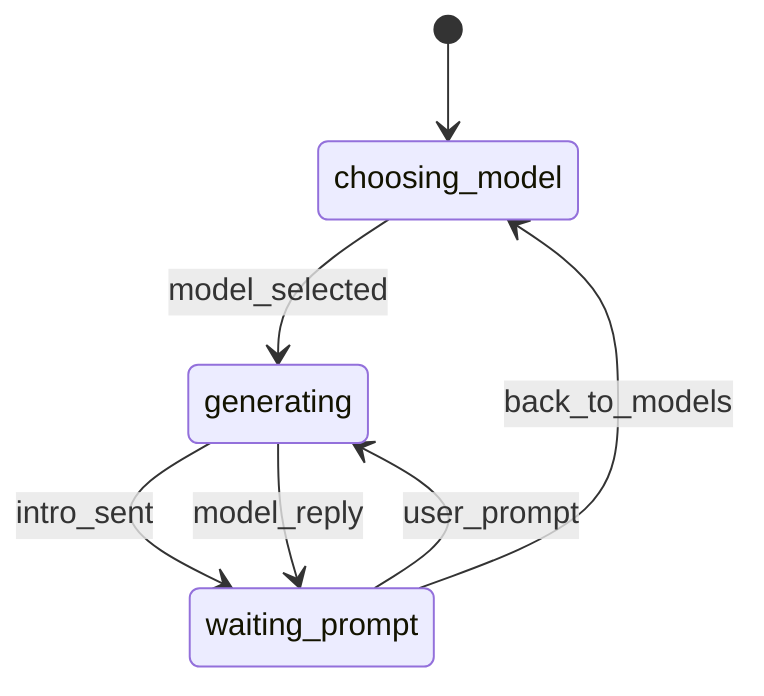

# Multi-AI Telegram Bot


Multi-AI Telegram Bot — это хаб ИИ-ассистентов в Telegram с выбором модели через OpenRouter.
Из коробки доступны Llama / DeepSeek / Claude / Grok, у каждой — собственное приветствие и позиционирование.
Внутри — чистая архитектура на aiogram v3, FSM для предсказуемых состояний, асинхронная обработка и аккуратный HTML-рендер Markdown-ответов.

Подходит для демонстраций заказчикам, быстрых прототипов и A/B-сравнения моделей без переписывания кода.


## ✨ Ключевые возможности

- **Выбор модели при старте** (+ мгновенное переключение «Back to Models»).
- **FSM-логика**: `choosing_model → waiting_prompt → generating` — предсказуемые хендлеры, без хаоса.
- **Асинхронность** и **anti-flood**: во время генерации пользователь получает мягкое уведомление, лишние сообщения не ломают поток.
- **HTML-рендер Markdown** + безопасное разбиение длинных ответов на части.
- **Кастомные интро** под каждую модель (самопрезентация ассистента).
- **Обработчики ошибок и таймауты** (не «висим» на медленных ответах).
- **Модульная структура** — добавление новой модели занимает минуты.
- Команды: **/start**, **/models**, **/cancel**.

## Архитектура (модули)

- `app/models/*.py` — интеграции с провайдерами (Llama, DeepSeek, Claude, Grok и т.д.).
- `app/Utils/render.py` — Markdown → HTML (экранирование), отправка длинных ответов.
- `app/Utils/handlers.py` — основной роутинг, состояния, анти-флуд.
- `app/Utils/keyboards.py` — inline-клавиатуры (выбор модели, назад).
- `app/Utils/dicts.py` — реестр моделей: заголовки, алиасы, функции вызова.
- `app/Utils/states.py` — FSM-состояния.
- `main.py` — инициализация бота, запуск.

## Поток работы



## 📁 Структура (пример)
```text
.
├── app/
│   ├── models/
│   │   ├── anthropic.py
│   │   ├── deepseek.py
│   │   ├── gemini.py
│   │   ├── llama.py
│   │   └── xai.py
│   ├── Utils/
│   │   ├── render.py
│   │   ├── dicts.py
│   │   ├── handlers.py
│   │   ├── keyboards.py
│   │   └── states.py
│   └── __init__.py
├── main.py
├── requirements.txt
├── .env.example
├── .gitignore
├── LICENSE
└── README.md
```

## 🚀 Быстрый старт
1) Установить зависимости:
```bash
python -m venv .venv && . .venv/bin/activate  # Windows: .venv\Scripts\activate
pip install -r requirements.txt
```

2) Создать .env на основе примера:
```bash
cp .env.example .env
# вставьте TG_TOKEN и AI_TOKEN
```

3) Запуск:
```bash
python main.py
```

## ⚙️ Переменные окружения
- `TG_TOKEN` — токен Telegram-бота.
- `AI_TOKEN` — OpenRouter API key.
- Необязательные `*_MODEL` переменные позволяют переопределить модель провайдера.

## 🔌 Добавление новой модели
1. Создать `app/models/<new_model>.py` с функцией `async def model_<name>(text: str) -> str`.
2. Зарегистрировать её в реестре в `dicts.py` (и при желании в клавиатуре).
3. Готово — кнопка появится автоматически.

## 🧪 Команды
- `/start` — выбрать модель.
- `/models` — вернуться к выбору.
- `/cancel` — сбросить состояние.

## 🛡 Безопасность
- Секреты — только через `.env` (в репозиторий не коммитим).
- По умолчанию бот не сохраняет данные/диалоги (для продакшена добавьте Redis/БД).
- Для долгих запросов — таймауты (`asyncio.wait_for`) и ретраи.

## 🗺 Roadmap
- [ ] RedisStorage для FSM
- [ ] Таймауты и ретраи запросов к API
- [ ] Режимы: creative / code / translate
- [ ] История контекста по каждой модели
- [ ] Dockerfile + деплой (Render/Heroku)


