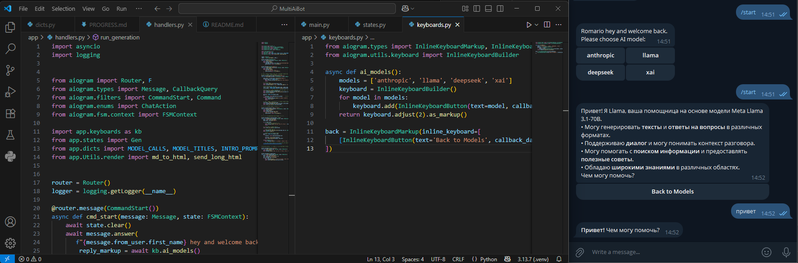

# Multi-AI Telegram Bot

Мульти-модельный Telegram-бот с выбором ИИ-модели через OpenRouter, FSM-состояниями и аккуратным HTML-рендером ответов.



## ✨ Возможности
- Выбор модели при старте: Llama, DeepSeek, Claude, Grok (легко расширяется).
- У каждой модели своё приветствие и описание возможностей.
- FSM: choosing_model → waiting_prompt → generating.
- Асинхронная обработка, защита от флуда во время генерации.
- HTML-рендер Markdown-ответов + разбиение длинных сообщений.
- Кнопка Back to Models для быстрого переключения.

## 🧱 Стек
- Python, aiogram v3
- OpenRouter API (через официальный клиент openai)
- python-dotenv

## 📁 Структура (пример)
```text
.
├── app/
│   ├── models/
│   │   ├── anthropic.py
│   │   ├── deepseek.py
│   │   ├── gemini.py
│   │   ├── llama.py
│   │   └── xai.py
│   ├── Utils/
│   │   ├── render.py
│   │   ├── dicts.py
│   │   ├── handlers.py
│   │   ├── keyboards.py
│   │   └── states.py
│   └── __init__.py
├── main.py
├── requirements.txt
├── .env.example
├── .gitignore
├── LICENSE
└── README.md
```

## 🚀 Быстрый старт
1) Установить зависимости:
```bash
python -m venv .venv && . .venv/bin/activate  # Windows: .venv\Scripts\activate
pip install -r requirements.txt
```

3) Создать .env на основе примера:
```bash
cp .env.example .env
```
# вставьте TG_TOKEN и AI_TOKEN

3) Запуск:
```bash
python main.py
```

## ⚙️ Переменные окружения
- TG_TOKEN — токен Telegram-бота.
- AI_TOKEN — OpenRouter API key.
- Необязательные *_MODEL переменные позволяют переопределить модель провайдера.

## 🔌 Добавление новой модели
1. Создать app/models/<new_model>.py с функцией async def model_<name>(text: str) -> str.
2. Зарегистрировать её в реестре в dicts.py (и при желании в клавиатуре).
3. Готово — кнопка появится автоматически.

## 🧪 Команды
- /start — выбрать модель.
- /models — вернуться к выбору.
- /cancel — сбросить состояние.

## 🛡 Безопасность
Секреты в репозиторий не коммитим — используйте .env (есть .env.example).

## 🗺 Roadmap
- [ ] RedisStorage для FSM
- [ ] Таймауты и ретраи запросов к API
- [ ] Режимы: creative / code / translate
- [ ] История контекста по каждой модели
- [ ] Dockerfile + деплой (Render/Heroku)
